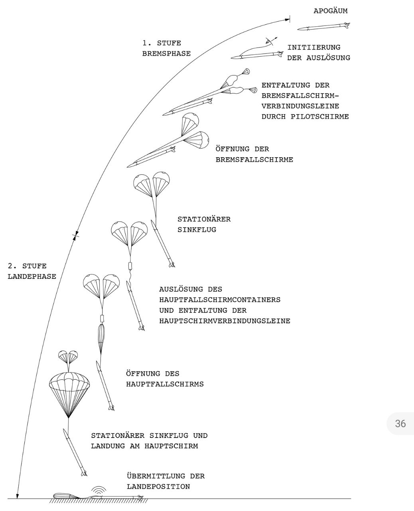

 FreeFall
 
 Fallschirmfall Simulation
  
 # Requirements
 
Python 3.7 (Tip: Virtual Environment)
in PyCharm, right click 'src' > 'Mark as sources root'

run `Main.py`

## Packages

see `requirements.txt`. 

install all with `python -m pip install -r requirements.txt`

* bokeh (not used anymore?!)
* numpy
* matplotlib
* scipy

  
 #Process
  
  